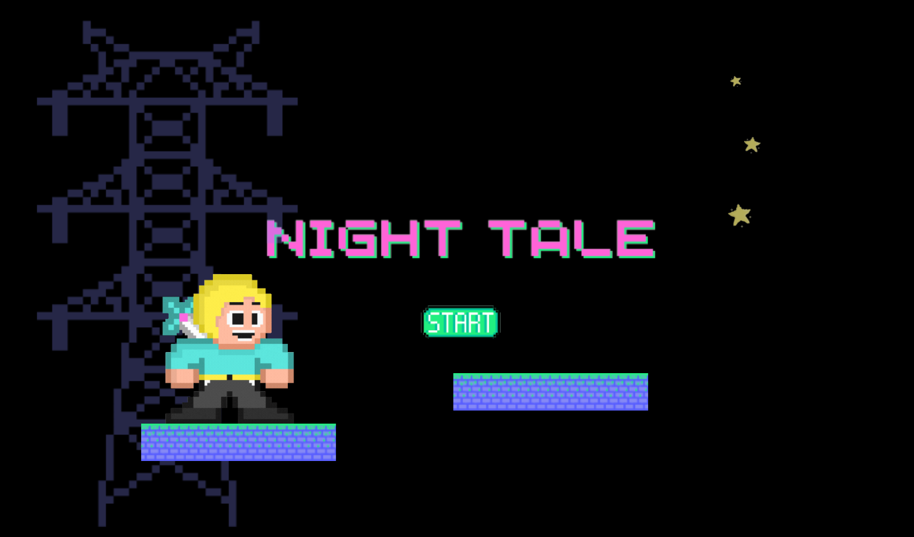
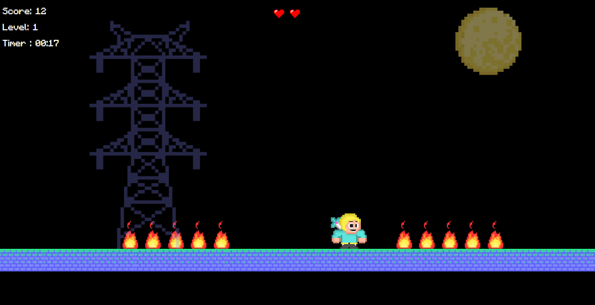
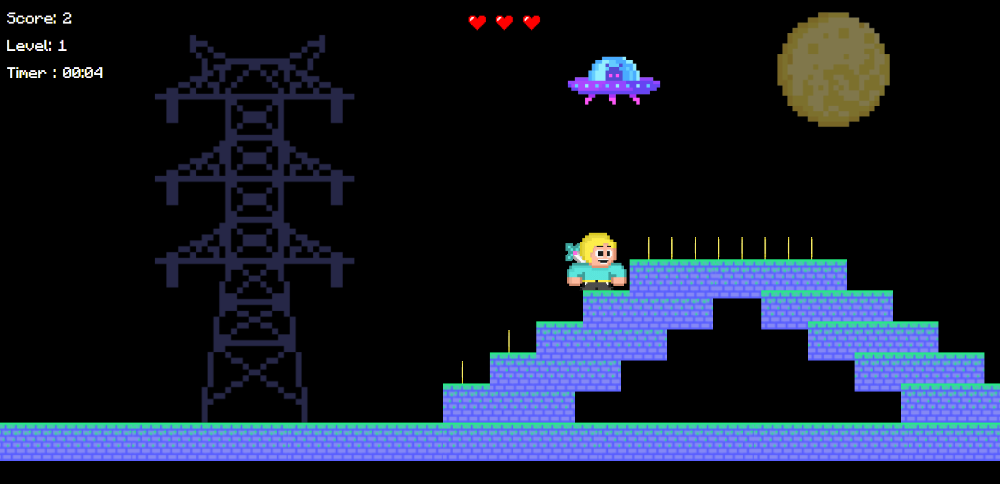
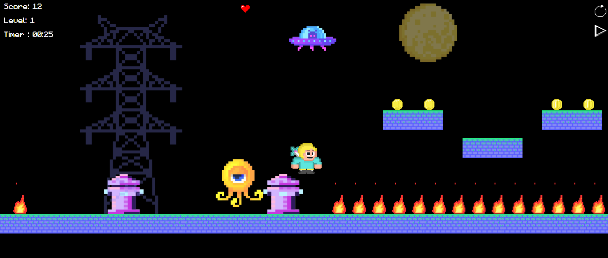

# Mario-Style Platformer Game (HTML + JavaScript)

A fun 2D Mario-style platformer game created entirely with **HTML**, **CSS**, and **vanilla JavaScript** — no game engines or external libraries!

## Project Structure

```
mario-similar/
├── assets/            # Game graphics (player, enemies, tiles, etc.)
├── css/               # CSS styling folder
├── draw.js            # Handles rendering game elements
├── game.js            # Main entry point for game logic
├── index.html         # Main HTML file
├── loader.js          # Loads game assets (images, sprites, etc.)
├── timer.js           # Manages time-based game events
├── update.js          # Handles physics and game state updates
├── readme.md          # Project documentation (you're here!)
```

## Features

- Classic 2D side-scrolling platform mechanics
- Keyboard control for movement and jumping
- Tile-based environment with obstacles
- Coin and score tracking
- Modular game files (draw, update, loader, timer)

## Controls

- **Arrow keys** — Move left/right/jump
- **Spacebar** — bullet

## Technologies Used

- **HTML5** – Structure and canvas rendering
- **CSS3** – Styling (located in the `/css` folder)
- **JavaScript** – Game logic and rendering:
  - `game.js`: Core game controller
  - `draw.js`: Responsible for drawing sprites and tiles
  - `update.js`: Updates player physics and level state
  - `loader.js`: Loads assets like images
  - `timer.js`: Timing control for animation and logic

## How to Run

1. Clone or download this repo.
2. Open `index.html` in your browser (no build tools or server needed).
3. Great Option: python -m http.server 8000

> ⚠️ Make sure all related files (`.js`, `/assets`, `/css`) are in the same folder hierarchy as shown.

## TODO (Optional Enhancements)

- Activate music and sound effects
- Improve mobile responsiveness

## Preview






---

🧑‍💻 Created by 

**Malak Ahmed**  
Full-stack developer & cybersecurity enthusiast
(https://github.com/NADRA03)

**Fatima Sayed Saeed**
Full-stack developer
(https://github.com/Fatimasayed75)

**Ghadeer**
Full-stack developer
(https://github.com/Ghadeerl)


